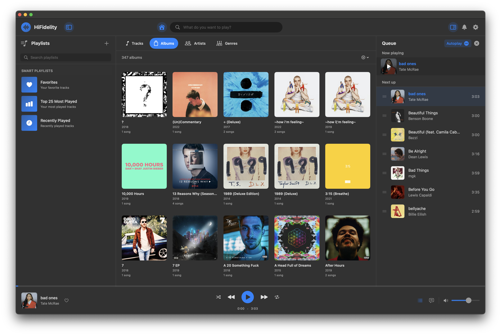
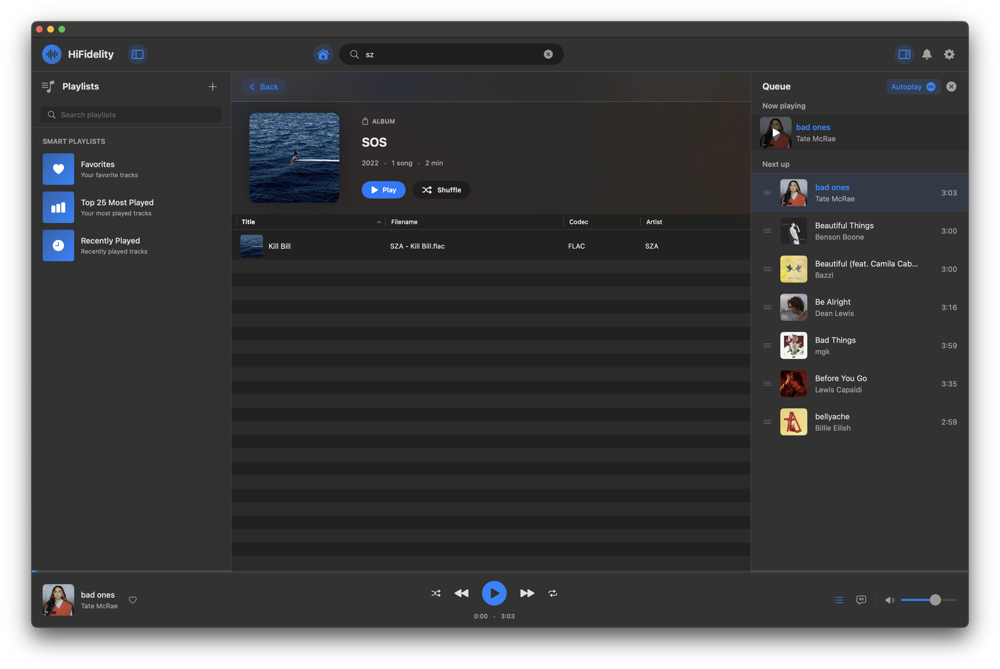
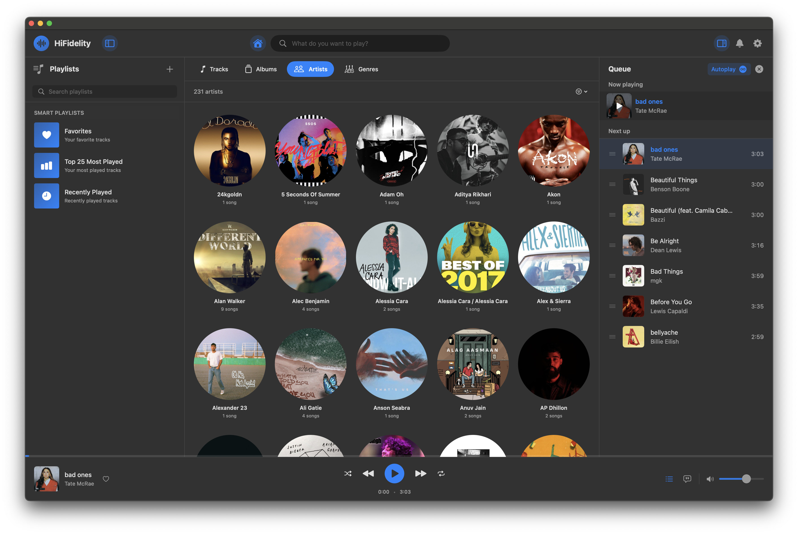
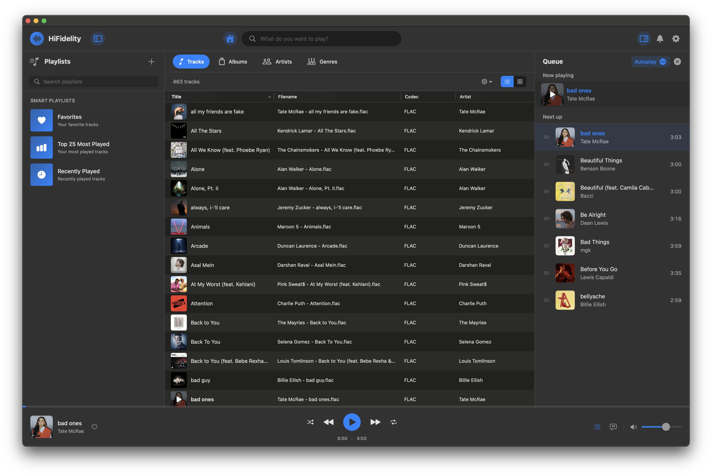
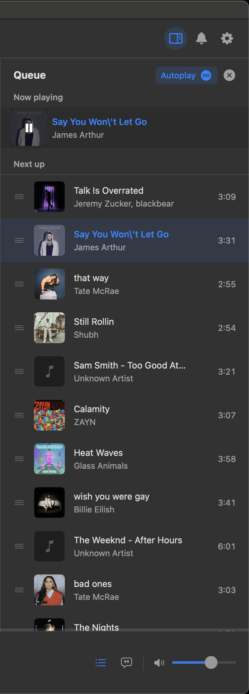
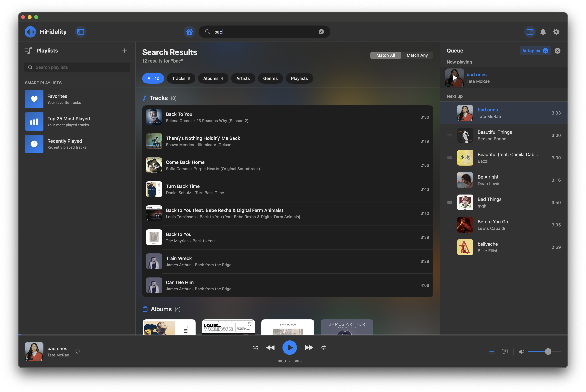

# HiFidelity


<div>
<h3>HiFidelity</h3>
<p>A modern, offline-first music player for macOS with high-fidelity audio playback</p>
<a href="https://github.com/rvarunrathod/HiFidelity/releases/latest"></a>
</div>
<br/><br/>

****
## Note: This is not malware.
> How to fix it 

1. Open System **Settings**
2. Go to **Privacy & Security**
3. Scroll down until you see a message saying: “HiFidelity was blocked because it is not from an identified developer.”
4. Click **Allow Anyway**
5. Open HiFidelity again
6. When macOS asks, click Open

****

HiFidelity is a native macOS music player built for audiophiles and music enthusiasts who want complete control over their music library without relying on streaming services or cloud storage.



---

## ✨ Features

- Powered by the BASS (un4seen) audio library for professional-grade audio quality and TagLib for meta-data reading
- Support for 30+ audio formats including lossless and high-resolution files
  - **Lossless & Hi-Res**: FLAC, OGA, WAV, AIFF, AIF, APE, WV, TTA, DFF, DSF  
  - **Compressed**: MP3, MP2, AAC, OGG, OPUS, M4A, M4B, M4P, MP4, M4V, MPC  
  - **Specialized**: CAF, WEBM, SPX
- Built-in equalizer with customizable presets
- Browse by tracks, albums, artists, or genres
- **Smart Recommendations**: Auto play functionality, you don't have to think what to play next
- **Lyrics**: Directly download lyrics within App and, Synced lyrics support with real-time highlighting powered by [lrclib](https://lrclib.net/)
- **Advanced Search**: Find tracks instantly across your entire library with FTS5 
- **Playback History**: Keep track of what you've listened to
- **Favorites**: Mark and organize your favorite tracks
- Menu bar controls and Now Playing info


#### First Launch?

1. Open **Settings → Library** Add folders containing your music files.
2. HiFidelity will automatically scan and import your music.
3. Start enjoying your music collection!

## 📷 Screenshots

#### Library Views
<div align="center">
  
  
  
</div>

#### Audio Features
<div align="center">
  
</div>

#### Smart Features
<div align="center">
  
  
  
</div>

### 🛠 Requirements

- **macOS 14.0** (Sonoma) or later
- Apple Silicon or Intel Macs 


### ⚡ Development 

#### From Source

1. Clone the repository:
```bash
git clone https://github.com/rvarunrathod/HiFidelity.git
cd HiFidelity
```

2. Open `HiFidelity.xcodeproj` in Xcode 15 or later

3. Build and run (⌘R)

---

#### Privacy & Security

- **No Internet Required**: Works completely offline
- **No Data Collection**: This app don't collect or transmit any data
- **Sandboxed**: Follows macOS security best practices

#### Acknowledgments

- [**BASS Audio Library**](https://www.un4seen.com/): Professional audio engine
- [**TagLib**](https://taglib.org/): Metadata extraction
- [**GRDB**](https://github.com/groue/GRDB.swift): Fast, reliable local database
- [**Sparkle**](https://github.com/sparkle-project/Sparkle): A software update framework for macOS
- [**Lrclib**](https://lrclib.net/): Utility for mass-downloading LRC synced lyrics for your offline music library. 
- [**Petrichor**](https://github.com/kushalpandya/Petrichora): Learned lot from this code

---

**Built with ❤️ for music lovers who value quality, privacy, and control**

[Website](https://rvarunrathod.github.io/HiFidelity) • [Wiki](https://github.com/rvarunrathod/HiFidelity/wiki) • [Issues](https://github.com/rvarunrathod/HiFidelity/issues)

